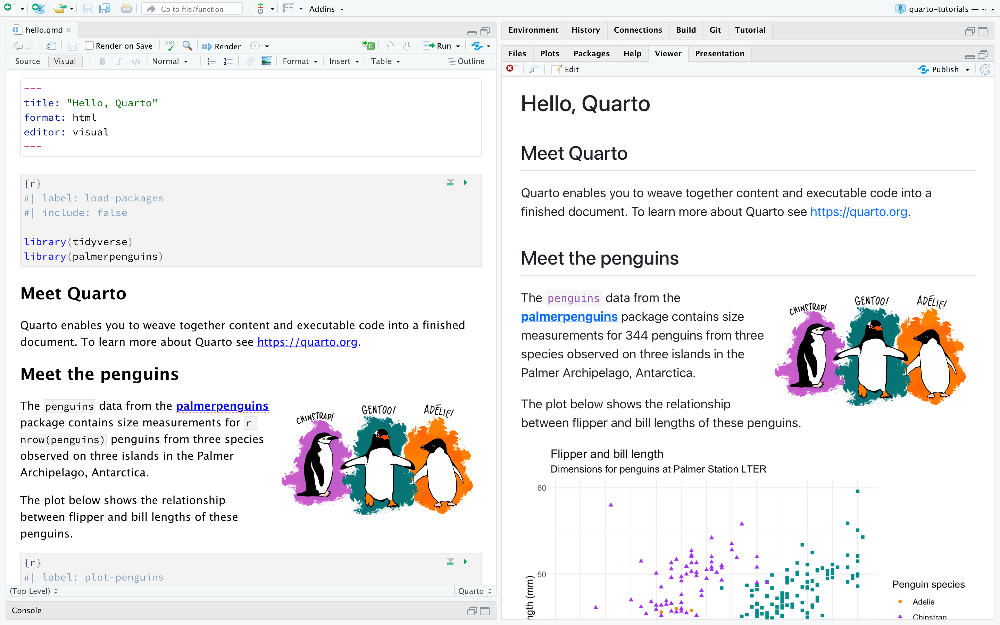

## 1. Install Quarto

-   Download and install from <https://quarto.org/docs/get-started/>.\
-   Ensure R is installed if you plan to execute code chunks.\

::: embed
<iframe src="https://quarto.org/docs/get-started/" width="100%" height="450">
</iframe>
:::

------------------------------------------------------------------------

## 2. Create or open a new document

-   Create a new document, or\
-   [Download](https://github.com/gianlucaboo/sampling_design_workshop/blob/main/02_samplingDesing_introduction/02_quartoReporting_exercise.qmd) and open an existing document.\

{width="500"}\

ℹ️ Try click on the button **Render**.

------------------------------------------------------------------------

## 3. Two main editing modes

Quarto lets you choose between a **Visual Editor** and a **Source (Code) Editor**.

### Visual Editor
- WYSIWYG interface similar to a word processor.
- Ideal for those who prefer formatting buttons and live preview.
- Features include toolbar for headings, lists, tables, and inserting code chunks.

### Source (Code) Editor
- Plain-text editing of the `.qmd` file.
- Preferred by users comfortable with Markdown and YAML.
- Works well with version control systems like Git.

ℹ️ Try to inspect the document. You can switch between Visual and Source modes at any time; both modes save the same underlying `.qmd` text.

------------------------------------------------------------------------

## 4. Document structure elements

Quarto uses **YAML front matter** for metadata and **Markdown** for content.

### YAML Front Matter
Example:
```yaml
---
title: "My Analysis"
author: "Jane Doe"
date: "2025-09-15"
format: html
---
```
- Sets metadata such as title, author, date, and output format.

------------------------------------------------------------------------

### Headings
- `#` Level 1
- `##` Level 2
- `###` Level 3

### Lists
- Bullet list:
  - Item one
  - Item two
- Numbered list:
  1. First
  2. Second

ℹ️ Try to add headings and list in the document.

------------------------------------------------------------------------

### Code Chunks
- Supports many languages (R, Python, Julia, Bash, etc.).
- Chunk options (e.g., `echo`, `eval`, `fig.width`) modify output.

```{r}
#| echo: true
summary(cars)
```


ℹ️ Try to find code chunks in the document.


------------------------------------------------------------------------

### Callouts
Create callouts for tips or warnings:
::: {.callout-note}
Note that there are five types of callouts, including:
`note`, `warning`, `important`, `tip`, and `caution`.
:::

::: {.callout-tip}
## Tip with Title

This is an example of a callout with a title.
:::

::: {.callout-caution collapse="true"}
## Expand To Learn About Collapse

This is an example of a 'folded' caution callout that can be expanded by the user. You can use `collapse="true"` to collapse it by default or `collapse="false"` to make a collapsible callout that is expanded by default.
:::

ℹ️ Try to add callouts using the visual mode in the document.

------------------------------------------------------------------------

### Tables
Create simple tables using pipe syntax:
```
| Column1 | Column2 |
|--------:|:-------:|
|   10    |   20    |
```

### Images


ℹ️ Try to add tables and images using the visual mode in the document.

------------------------------------------------------------------------

## 3. Example Document Layout

```markdown
---
title: "Sales Analysis Report"
format: html
---

# Introduction
Brief description…

## Data Preparation
```{r}
library(dplyr)
# your code here
```

## Results
- Key finding 1
- Key finding 2
```

------------------------------------------------------------------------

## 5. Customize Appearance

Use a built-in theme:

    ``` yaml
    format:
      html:
        theme: cosmo
    ```

ℹ️ Try different themes from <https://quarto.org/docs/output-formats/html-themes.html>.

------------------------------------------------------------------------

## 6. Resources

-   Documentation: <https://quarto.org/docs/>
-   Tutorials and guides: <https://quarto.org/docs/get-started/>
-   Community support via RStudio Community and GitHub discussions.