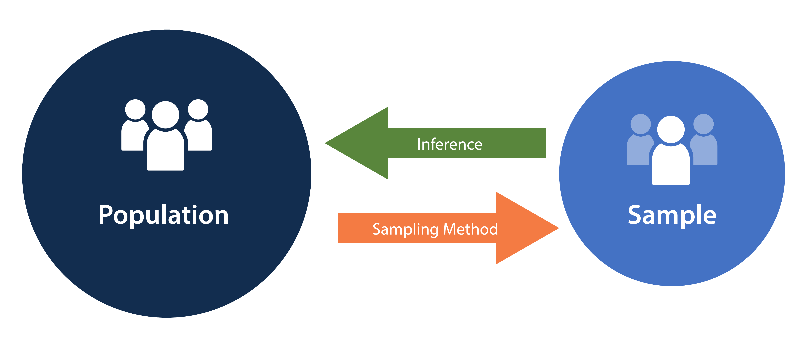
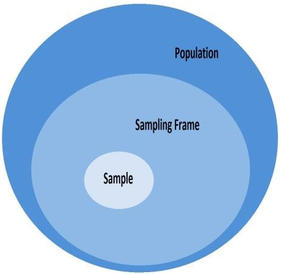
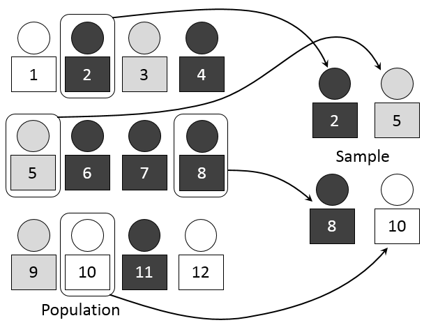
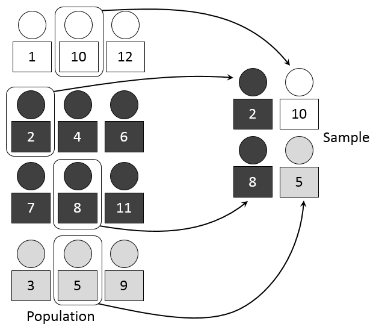
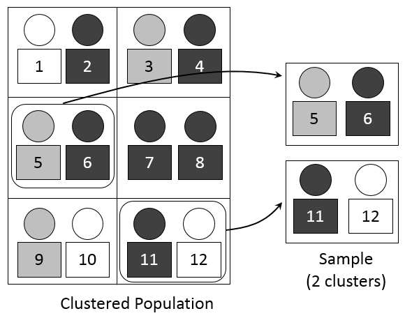

## Workshop's agenda

-   **Day 1**: Introduction to QGIS
-   **Day 2**: Automatic update of census EA and national sampling frame
-   **Day 3**: Introduction to R programming
-   **Day 4**: Introduction to Sampling Design
-   **Day 5**: Advanced R programming
-   **Day 6**: Earth observation (EO) for sampling design
-   **Day 7**: AI and machine learning for sample selection
-   **Day 8**: Simulation and optimization of sampling strategies
-   **Day 9**: R Shiny for sampling design evaluation
-   **Day 10**: Wrap-up and workshop evaluation

------------------------------------------------------------------------

## Today's agenda

-   Introduction to sampling concepts
-   Probability sampling methods
-   Weighted sampling and unequal probability designs
-   Practical implementation in R
-   Design considerations and summary
-   Practical exercises

------------------------------------------------------------------------

## Sampling

::::: columns
::: {.column width="80%"}
-   **Definition**: sampling is the process of selecting a subset (called a **sample**) from a larger **population** to estimate characteristics of that population.
-   **Purpose**: enables inference when measuring the entire population is costly or impractical. This offers the followwing advantages:
    -   **Cost-effective**: sampling requires fewer resources than a full census.
    -   **Feasibility**: some populations cannot be fully measured.
    -   **Timely insights**: faster data collection for timely decision-making.
:::

::: {.column width="20%"}
:::
:::::

{fig-align="left" width="429"}

------------------------------------------------------------------------

## Key concepts

::::: columns
::: {.column width="70%"}
**Population**

-   The **entire set of elements** (people, objects, events) you want to study.\
-   Provides the **scope** of inference for your study.\
-   **Example**: all university students in a country.

**Sampling frame**

-   The **list or mechanism** used to identify and access members of the population.\
-   Ideally a sampling frame **should be**:
    -   **Complete**: covers all members of population.
    -   **Accurate**: no duplicates, no outdated entries.
    -   **Accessible**: researcher can reach listed units.\
-   **Example**: an official student enrollment database.
:::

::: {.column width="30%"}
{fig-align="left" width="354"}
:::
:::::

ℹ️ If the sampling frame does not fully represent the population, **sampling bias** may occur.

------------------------------------------------------------------------

## Key concepts

::::: columns
::: {.column width="70%"}
**Sample**

-   A **subset of the population** selected for analysis.
-   Used to make **inferences** about the population.
-   **Example**: 1,000 students chosen from the national student population.

**Sampling**

-   The **process or method** of selecting units from the population to form a sample.
-   The **goal** is achieving a representative and unbiased sample.
-   **Example**: students are selected randomly.
:::

::: {.column width="30%"}
{fig-align="left" width="354"}
:::
:::::

ℹ️ **Sampling design** formalizes the plan for selecting a representative sample.

------------------------------------------------------------------------

## Sampling design

::::: columns
::: {.column width="50%"}
-   A **sampling design** defines how samples are chosen and the probability each unit has of being selected.
-   **Sampling design** includes aspects like:
    -   **Probability versus non-probability sampling**
    -   **Sampling technique**
    -   **Sample size**
    -   **Allocation strategies**
    -   **Bias and representativeness**
:::

::: {.column width="50%"}
{fig-align="center" width="354"}
:::
:::::

ℹ️ In this workshop we will cover **probability sampling** only.

------------------------------------------------------------------------

## Simple random sampling

-   Every possible subset of size *n* from a population *N* has an **equal probability of being selected**.
-   **Used when** complete list of the population is available.

{fig-align="left" width="280"}

------------------------------------------------------------------------

## Simple random sampling

::::: columns
::: {.column width="60%"}
**Sample mean** $$
    \bar{x} = \frac{1}{n} \sum_{i=1}^{n} x_i
    $$

**Sample variance** $$
    s^2 = \frac{1}{n-1} \sum_{i=1}^{n} (x_i - \bar{x})^2
    $$

**Population mean** $$
    \mu = \frac{1}{N} \sum_{i=1}^{N} x_i
    $$ **Population variance** $$
    \sigma^2 = \frac{1}{N} \sum_{i=1}^{N} (x_i - \mu)^2
    $$
:::

::: {.column width="40%"}
$x$: sampled values

$\mu$: population mean

$\sigma^2$: population variance

$n$: sample size

$N$: population size
:::
:::::

ℹ️ The sample mean can be computed by substituting $N$ with $n$, while the sample variance by substituting $N$ with $n$ and $n-1$ in the denominator.

------------------------------------------------------------------------

## Simple random sampling

### Implementation in R

``` {.r style="height:450px;"}
library(tidyverse)                     # Load tidyverse for data manipulation
set.seed(123)                          # Set seed for reproducibility

N <- 10000                             # Define population size
pop <- data.frame(id = 1:N,            # Create population dataframe with IDs
                  y  = rlnorm(N,       # Generate log-normal random values
                  meanlog = 2,
                  sdlog = 0.5))

n <- 500                               # Define sample size
s_ids <- sample(pop$id, size = n,      # Randomly select n IDs without replacement
                replace = FALSE)
samp <- pop |> filter(pop$id %in% s_ids) # Extract sampled observations

ybar_hat <- mean(samp$y)               # Sample mean of y
Y_hat <- N * ybar_hat                  # Estimate of population total (N * sample mean)

s2 <- var(samp$y)                      # Sample variance of y
var_ybar <- (1 - n/N) * s2 / n         # Variance of sample mean with finite pop. correction
se_ybar <- sqrt(var_ybar)              # Standard error of sample mean

list(ybar_hat = ybar_hat,              # Return list with results:
     Y_hat = Y_hat,                    # - Sample mean
     se_ybar = se_ybar)                # - Estimated population total
                                       # - Standard error of sample mean
```

ℹ️ Try to run the code in your Script Editor.

------------------------------------------------------------------------

## Stratified sampling

-   Population is divided into **homogeneous subgroups (strata)** and a **simple random sample** is drawn **within each stratum**.
-   Improves efficiency by reducing variability **within strata**.

{fig-align="left" width="280"}

------------------------------------------------------------------------

## Stratified sampling

::::: columns
::: {.column width="60%"}
**Sample mean**: $$ 
    \bar{x}_{st} = \sum_{h=1}^H W_h \bar{x}_h
    $$ **Approximate variance** $$
    \operatorname{Var}(\bar{x}_{st}) = \sum_{h=1}^H W_h^2 \frac{\sigma_h^2}{n_h} \left(1 - \frac{n_h}{N_h}\right)
    $$ **Population mean** $$ 
    \mu = \frac{1}{N} \sum_{h=1}^{H} \sum_{i=1}^{N_h} x_{hi}
    $$ **Population variance** $$
      \sigma^2 = \frac{1}{N} \sum_{h=1}^{H} \sum_{i=1}^{N_h} (x_{hi} - \mu)^2
    $$
:::

::: {.column width="40%"}
$N_h$: size of stratum $h$;

$n_h$: sample size for stratum $h$;

$N$: total population size;

$W_h=\dfrac{N_h}{N}$: population weight of $h$,

$f_h=\dfrac{n_h}{N_h}$: sampling fraction in $h$,

$\bar x_h$: sample mean in $h$,

$s_h^2=$: sample variance in $h$.
:::
:::::

------------------------------------------------------------------------

## Stratified sampling

### Implementation in R

``` {.r style="height:450px;"}
set.seed(7)                                # Set seed for reproducibility
H <- 3                                     # Number of strata
N_h <- c(4000, 3000, 3000)                 # Population sizes for each stratum

stratum <- rep(1:H, times = N_h)           # Vector labeling each unit's stratum
pop <- data.frame(id = 1:sum(N_h),         # Build full population dataset
                  h = stratum,             #   - stratum membership
                  y = c(rnorm(N_h[1], 50, 10),  #   - outcomes for stratum 1
                        rnorm(N_h[2], 60, 15),  #   - outcomes for stratum 2
                        rnorm(N_h[3], 55, 12))) #   - outcomes for stratum 3

N <- nrow(pop)                             # Total population size
W_h <- N_h / N                             # Stratum weights (proportion of population)
n <- 600                                   # Desired total sample size

n_h <- round(n * W_h)                      # Allocate sample size per stratum (proportional allocation)

# Draw samples from each stratum
samp_list <- lapply(1:H, function(h){      
  ids <- which(pop$h == h)                 # Identify units in stratum h
  pick <- sample(ids, size = n_h[h],       # Randomly select n_h units without replacement
                 replace = FALSE)
  pop[pick, ]                              # Return sampled data
})

samp <- do.call(rbind, samp_list)          # Combine stratum samples into one dataset

ybar_h <- tapply(samp$y, samp$h, mean)     # Compute sample mean within each stratum
Ybar_hat <- sum(W_h * ybar_h)              # Weighted average of stratum means (overall estimate)
Ybar_hat                                   # Print estimated population mean
```

ℹ️ Try to run the code in your Script Editor.

------------------------------------------------------------------------

## Cluster sampling

-   Population is divided into **clusters**, often based on geography or natural groupings.
-   A **random sample of clusters** is selected, and **all (or a sample of) units within selected clusters** are observed.

{fig-align="left" width="354"}

------------------------------------------------------------------------

## Cluster sampling

::::: columns
::: {.column width="70%"}
**Cluster sample mean** $$
\bar{x}_{cl} = \frac{1}{n_c} \sum_{c \in S} \bar{x}_c
$$ **Approximate variance of** $\bar{x}_CL$: $$
\operatorname{Var}(\bar{x}_{cl}) = \frac{1}{n_c} \left(1 - \frac{n_c}{C}\right) S_c^2
$$ **Population mean** $$
\mu = \frac{1}{N} \sum_{c=1}^{C} \sum_{i=1}^{N_c} x_{ci}
$$ **Population variance** $$
\sigma^2 = \frac{1}{N} \sum_{c=1}^{C} \sum_{i=1}^{N_c} (x_{ci} - \mu)^2
$$
:::

::: {.column width="30%"}
$N$: Population size\
$C$: Number of clusters in the population\
$N_c$: Size of cluster\
$n_c$: Number of clusters sampled\
$x_{ci}$: Value of the $i$-th element in cluster $c$\
$\bar{x}_c$: Mean of cluster $c$\
$\bar{x}_{cl}$: Mean of sampled clusters\
$\mu$: Population mean\
$\sigma^2$: Population variance\
$S_c^2$: Variance of cluster means\
$S$: Set of sampled clusters
:::
:::::

------------------------------------------------------------------------

## Cluster sampling

### Implementation in R

``` {.r style="height:450px;"}
set.seed(11)                           # Set random seed for reproducibility
J <- 100                               # Number of clusters in the population
mbar <- 20                             # Average cluster size
rho <- 0.15                            # Intra-cluster correlation (ICC)

M_j <- rpois(J, mbar-1) + 1            # Cluster sizes (Poisson around mbar)
mu <- 50                               # Overall population mean
sigma2 <- 100                          # Total variance of outcomes
tau2 <- rho * sigma2                   # Between-cluster variance component
sigma2_within <- (1-rho) * sigma2      # Within-cluster variance component
cluster_effect <- rnorm(J, 0, sqrt(tau2)) # Random cluster effects ~ N(0, tau2)

data <- do.call(rbind, lapply(1:J, function(j){   # Generate population data
  m <- M_j[j]                          # Size of cluster j
  y <- mu + cluster_effect[j] +        # Mean + cluster effect +
       rnorm(m, 0, sqrt(sigma2_within))# individual error within cluster
  data.frame(cluster=j, y=y)           # Store results in dataframe
}))

n_c <- 20                              # Number of clusters to sample
sel_clust <- sample(1:J, n_c)          # Randomly select clusters
samp <- subset(data, cluster %in% sel_clust) # Extract all units in sampled clusters

t_j <- aggregate(y ~ cluster, samp, sum)     # Cluster totals of y in sample
M_sel <- aggregate(y ~ cluster, samp, length)# Cluster sizes in sample
names(M_sel)[2] <- "m"

Y_hat <- (J / n_c) * sum(t_j$y)              # Estimated population total (expansion factor J/n_c)
N_hat <- (J / n_c) * sum(M_sel$m)            # Estimated population size
Ybar_hat <- Y_hat / N_hat                    # Estimated population mean
Ybar_hat                                     # Print estimate
```

ℹ️ Try to run the code in your Script Editor.

------------------------------------------------------------------------

## Weighted sampling

-   Each unit in the population is assigned a **weight** reflecting its **probability of selection**.
-   Units with higher weights have **greater influence** on the estimate.
-   Often used in **complex surveys** or **unequal probability sampling** designs.

::::: columns
::: {.column width="70%"}
```{=html}
<svg viewBox="0 0 800 430" xmlns="http://www.w3.org/2000/svg">
  <!-- Population Grid -->
  <g id="population">
    <!-- Row 1 -->
    <g id="row1">
      <!-- Element 1 (weight 1) -->
      <circle cx="60" cy="60" r="25" fill="#e0e0e0" stroke="#666" stroke-width="2"/>
      <rect x="30" y="85" width="60" height="30" fill="white" stroke="#666" stroke-width="1" rx="3"/>
      <text x="60" y="105" text-anchor="middle" font-family="Arial" font-size="14" font-weight="bold">1</text>
      <text x="60" y="130" text-anchor="middle" font-family="Arial" font-size="10">w=1</text>
      
      <!-- Element 2 (weight 5) - larger -->
      <circle cx="150" cy="60" r="35" fill="#4a4a4a" stroke="#666" stroke-width="2"/>
      <rect x="115" y="85" width="70" height="30" fill="#4a4a4a" stroke="#666" stroke-width="1" rx="3"/>
      <text x="150" y="105" text-anchor="middle" font-family="Arial" font-size="14" font-weight="bold" fill="white">2</text>
      <text x="150" y="130" text-anchor="middle" font-family="Arial" font-size="10">w=5</text>
      
      <!-- Element 3 (weight 2) -->
      <circle cx="240" cy="60" r="28" fill="#b0b0b0" stroke="#666" stroke-width="2"/>
      <rect x="210" y="85" width="60" height="30" fill="white" stroke="#666" stroke-width="1" rx="3"/>
      <text x="240" y="105" text-anchor="middle" font-family="Arial" font-size="14" font-weight="bold">3</text>
      <text x="240" y="130" text-anchor="middle" font-family="Arial" font-size="10">w=2</text>
      
      <!-- Element 4 (weight 4) -->
      <circle cx="330" cy="60" r="32" fill="#2a2a2a" stroke="#666" stroke-width="2"/>
      <rect x="300" y="85" width="60" height="30" fill="#2a2a2a" stroke="#666" stroke-width="1" rx="3"/>
      <text x="330" y="105" text-anchor="middle" font-family="Arial" font-size="14" font-weight="bold" fill="white">4</text>
      <text x="330" y="130" text-anchor="middle" font-family="Arial" font-size="10">w=4</text>
    </g>
    
    <!-- Row 2 -->
    <g id="row2">
      <!-- Element 5 (weight 1) -->
      <circle cx="60" cy="180" r="25" fill="#e0e0e0" stroke="#666" stroke-width="2"/>
      <rect x="30" y="205" width="60" height="30" fill="white" stroke="#666" stroke-width="1" rx="3"/>
      <text x="60" y="225" text-anchor="middle" font-family="Arial" font-size="14" font-weight="bold">5</text>
      <text x="60" y="250" text-anchor="middle" font-family="Arial" font-size="10">w=1</text>
      
      <!-- Element 6 (weight 6) - largest -->
      <circle cx="150" cy="180" r="38" fill="#1a1a1a" stroke="#666" stroke-width="2"/>
      <rect x="112" y="205" width="76" height="30" fill="#1a1a1a" stroke="#666" stroke-width="1" rx="3"/>
      <text x="150" y="225" text-anchor="middle" font-family="Arial" font-size="14" font-weight="bold" fill="white">6</text>
      <text x="150" y="250" text-anchor="middle" font-family="Arial" font-size="10">w=6</text>
      
      <!-- Element 7 (weight 3) -->
      <circle cx="240" cy="180" r="30" fill="#3a3a3a" stroke="#666" stroke-width="2"/>
      <rect x="210" y="205" width="60" height="30" fill="#3a3a3a" stroke="#666" stroke-width="1" rx="3"/>
      <text x="240" y="225" text-anchor="middle" font-family="Arial" font-size="14" font-weight="bold" fill="white">7</text>
      <text x="240" y="250" text-anchor="middle" font-family="Arial" font-size="10">w=3</text>
      
      <!-- Element 8 (weight 2) -->
      <circle cx="330" cy="180" r="28" fill="#b0b0b0" stroke="#666" stroke-width="2"/>
      <rect x="300" y="205" width="60" height="30" fill="white" stroke="#666" stroke-width="1" rx="3"/>
      <text x="330" y="225" text-anchor="middle" font-family="Arial" font-size="14" font-weight="bold">8</text>
      <text x="330" y="250" text-anchor="middle" font-family="Arial" font-size="10">w=2</text>
    </g>
    
    <!-- Row 3 -->
    <g id="row3">
      <!-- Element 9 (weight 1) -->
      <circle cx="60" cy="300" r="25" fill="#e0e0e0" stroke="#666" stroke-width="2"/>
      <rect x="30" y="325" width="60" height="30" fill="white" stroke="#666" stroke-width="1" rx="3"/>
      <text x="60" y="345" text-anchor="middle" font-family="Arial" font-size="14" font-weight="bold">9</text>
      <text x="60" y="370" text-anchor="middle" font-family="Arial" font-size="10">w=1</text>
      
      <!-- Element 10 (weight 1) -->
      <circle cx="150" cy="300" r="25" fill="white" stroke="#666" stroke-width="2"/>
      <rect x="120" y="325" width="60" height="30" fill="white" stroke="#666" stroke-width="1" rx="3"/>
      <text x="150" y="345" text-anchor="middle" font-family="Arial" font-size="14" font-weight="bold">10</text>
      <text x="150" y="370" text-anchor="middle" font-family="Arial" font-size="10">w=1</text>
      
      <!-- Element 11 (weight 4) -->
      <circle cx="240" cy="300" r="32" fill="#2a2a2a" stroke="#666" stroke-width="2"/>
      <rect x="210" y="325" width="60" height="30" fill="#2a2a2a" stroke="#666" stroke-width="1" rx="3"/>
      <text x="240" y="345" text-anchor="middle" font-family="Arial" font-size="14" font-weight="bold" fill="white">11</text>
      <text x="240" y="370" text-anchor="middle" font-family="Arial" font-size="10">w=4</text>
      
      <!-- Element 12 (weight 1) -->
      <circle cx="330" cy="300" r="25" fill="white" stroke="#666" stroke-width="2"/>
      <rect x="300" y="325" width="60" height="30" fill="white" stroke="#666" stroke-width="1" rx="3"/>
      <text x="330" y="345" text-anchor="middle" font-family="Arial" font-size="14" font-weight="bold">12</text>
      <text x="330" y="370" text-anchor="middle" font-family="Arial" font-size="10">w=1</text>
    </g>
  </g>
  
  <!-- Population Label -->
  <text x="190" y="420" text-anchor="middle" font-family="Arial" font-size="18" font-weight="bold">Population</text>
  <text x="190" y="440" text-anchor="middle" font-family="Arial" font-size="12">(Elements sized by weight)</text>
  
  <!-- Curved arrows showing weighted selection -->
  <!-- Arrow to element 6 (highest weight) -->
  <path d="M 350 200 Q 450 150 550 180" fill="none" stroke="#333" stroke-width="3" marker-end="url(#arrowhead)"/>
  
  <!-- Arrow to element 2 (high weight) -->
  <path d="M 200 100 Q 400 50 600 80" fill="none" stroke="#333" stroke-width="2" marker-end="url(#arrowhead)"/>
  
  <!-- Arrow to element 11 (high weight) -->
  <path d="M 280 330 Q 450 350 550 280" fill="none" stroke="#333" stroke-width="2" marker-end="url(#arrowhead)"/>
  
  <!-- Sample elements (showing higher-weight elements more likely to be selected) -->
  <g id="sample">
    <!-- Sample element 1 (element 6) -->
    <circle cx="580" cy="120" r="30" fill="#1a1a1a" stroke="#666" stroke-width="2"/>
    <rect x="550" y="145" width="60" height="30" fill="#1a1a1a" stroke="#666" stroke-width="1" rx="3"/>
    <text x="580" y="165" text-anchor="middle" font-family="Arial" font-size="14" font-weight="bold" fill="white">6</text>
    
    <!-- Sample element 2 (element 2) -->
    <circle cx="660" cy="120" r="27" fill="#4a4a4a" stroke="#666" stroke-width="2"/>
    <rect x="635" y="145" width="50" height="30" fill="white" stroke="#666" stroke-width="1" rx="3"/>
    <text x="660" y="165" text-anchor="middle" font-family="Arial" font-size="14" font-weight="bold">2</text>
    
    <!-- Sample element 3 (element 11) -->
    <circle cx="580" cy="240" r="27" fill="#2a2a2a" stroke="#666" stroke-width="2"/>
    <rect x="555" y="265" width="50" height="30" fill="#2a2a2a" stroke="#666" stroke-width="1" rx="3"/>
    <text x="580" y="285" text-anchor="middle" font-family="Arial" font-size="14" font-weight="bold" fill="white">11</text>
    
    <!-- Sample element 4 (element 4) -->
    <circle cx="660" cy="240" r="25" fill="#2a2a2a" stroke="#666" stroke-width="2"/>
    <rect x="635" y="265" width="50" height="30" fill="white" stroke="#666" stroke-width="1" rx="3"/>
    <text x="660" y="285" text-anchor="middle" font-family="Arial" font-size="14" font-weight="bold">4</text>
  </g>
  
  <!-- Sample Label -->
  <text x="620" y="330" text-anchor="middle" font-family="Arial" font-size="16" font-weight="bold">Sample</text>
  <text x="620" y="350" text-anchor="middle" font-family="Arial" font-size="11">(Higher weights → Higher</text>
  <text x="620" y="365" text-anchor="middle" font-family="Arial" font-size="11">selection probability)</text>

  <!-- Arrow marker definition -->
  <defs>
    <marker id="arrowhead" markerWidth="10" markerHeight="7" refX="10" refY="3.5" orient="auto">
      <polygon points="0 0, 10 3.5, 0 7" fill="#333"/>
    </marker>
  </defs>
</svg>
```

[Probability weighted sampling.]{style="font-size:14px"}
:::

::: {.column width="30%"}
:::
:::::

------------------------------------------------------------------------

## Weighted sampling

::::: columns
::: {.column width="60%"}
**Population mean (weighted)** $$
\mu = \frac{\sum_{i=1}^{N} w_i x_i}{\sum_{i=1}^{N} w_i}
$$

**Population variance (weighted)** $$
\sigma^2 = \frac{\sum_{i=1}^{N} w_i (x_i - \mu)^2}{\sum_{i=1}^{N} w_i}
$$

**Weighted sample mean** $$
\bar{x}_w = \frac{\sum_{i \in S} w_i x_i}{\sum_{i \in S} w_i}
$$

**Approximate variance of** $\bar{x}_w$ $$
\operatorname{Var}(\bar{x}_w) \approx \sum_{i \in S} \frac{w_i^2}{(\sum_{i \in S} w_i)^2} (x_i - \bar{x}_w)^2
$$
:::

::: {.column width="40%"}
$N$: Population size\
$x_i$: Value of the $i$-th element in the population\
$w_i$:Weight of element $i$ (proportional to size)\
$S$: Set of sampled elements\
$\bar{x}_w$: Weighted sample mean\
$\mu$: Population mean (weighted)\
$\sigma^2$: Population variance (weighted)\
$\operatorname{Var}(\bar{x}_w)$: Approximate variance of weighted sample mean
:::
:::::

------------------------------------------------------------------------

## Weighted sampling

### Implementation in R

``` {.r style="height:450px;"}
set.seed(123)                              # Fix seed for reproducibility

N <- 1000                                  # Population size
x <- runif(N, 1, 10)                       # Size measure
y <- 5 + 2*x + rnorm(N)                    # Outcome correlated with x
pop <- data.frame(id=1:N, x=x, y=y)        # Store in a dataframe

n <- 100                                   # Sample size
srs <- pop[sample(1:N, n), ]               # Draw SRS without replacement
mean_srs <- mean(srs$y)                    # Sample mean (unweighted)
mean(pop$y)                                # True population mean (for comparison)

prob <- x / sum(x)                         # Selection probs proportional to x
samp_ids <- sample(1:N, n, prob=prob)      # Draw weighted sample
pps <- pop[samp_ids, ]                     # Extract sampled units
pps$w <- 1/prob[samp_ids]                  # Compute weights = 1 / inclusion prob

mean_pps <- sum(pps$w * pps$y) / sum(pps$w) # Weighted mean (Horvitz–Thompson estimator)

mean_srs                                   # Unweighted mean from SRS
mean_pps                                   # Weighted mean from PPS
mean(pop$y)                                # True population mean
```

ℹ️ Try to run the code in your Script Editor.

------------------------------------------------------------------------

## Multistage sampling

-   Sampling is conducted in **two or more stages**, selecting units at each stage.
-   Common design:
    -   Stage 1: Randomly sample **clusters** (e.g., schools).
    -   Stage 2: Randomly sample **elements within clusters** (e.g., students).
-   Useful when a complete list of all population units is unavailable.

::::: columns
::: {.column width="70%"}
```{=html}
<svg viewBox="0 0 900 430" xmlns="http://www.w3.org/2000/svg">
  <!-- Population - Stage 1: Clusters -->
  <g id="population">
    <!-- Cluster A -->
    <g id="clusterA">
      <rect x="50" y="50" width="180" height="120" fill="#f0f8ff" stroke="black" stroke-width="3" stroke-dasharray="8,4" rx="10"/>
      <text x="140" y="30" text-anchor="middle" font-family="Arial" font-size="14" font-weight="bold" fill="black">Cluster A</text>
      
      <!-- Elements in Cluster A -->
      <circle cx="80" cy="80" r="12" fill="#e0e0e0" stroke="#666" stroke-width="1"/>
      <text x="80" y="85" text-anchor="middle" font-family="Arial" font-size="10" font-weight="bold">1</text>
      
      <circle cx="120" cy="80" r="12" fill="#2a2a2a" stroke="#666" stroke-width="1"/>
      <text x="120" y="85" text-anchor="middle" font-family="Arial" font-size="10" font-weight="bold" fill="white">2</text>
      
      <circle cx="160" cy="80" r="12" fill="#e0e0e0" stroke="#666" stroke-width="1"/>
      <text x="160" y="85" text-anchor="middle" font-family="Arial" font-size="10" font-weight="bold">3</text>
      
      <circle cx="200" cy="80" r="12" fill="#2a2a2a" stroke="#666" stroke-width="1"/>
      <text x="200" y="85" text-anchor="middle" font-family="Arial" font-size="10" font-weight="bold" fill="white">4</text>
      
      <circle cx="80" cy="120" r="12" fill="#e0e0e0" stroke="#666" stroke-width="1"/>
      <text x="80" y="125" text-anchor="middle" font-family="Arial" font-size="10" font-weight="bold">5</text>
      
      <circle cx="120" cy="120" r="12" fill="#2a2a2a" stroke="#666" stroke-width="1"/>
      <text x="120" y="125" text-anchor="middle" font-family="Arial" font-size="10" font-weight="bold" fill="white">6</text>
      
      <circle cx="160" cy="120" r="12" fill="#e0e0e0" stroke="#666" stroke-width="1"/>
      <text x="160" y="125" text-anchor="middle" font-family="Arial" font-size="10" font-weight="bold">7</text>
      
      <circle cx="200" cy="120" r="12" fill="#2a2a2a" stroke="#666" stroke-width="1"/>
      <text x="200" y="125" text-anchor="middle" font-family="Arial" font-size="10" font-weight="bold" fill="white">8</text>
    </g>
    
    <!-- Cluster B -->
    <g id="clusterB">
      <rect x="280" y="50" width="180" height="120" fill="#fff0f8" stroke="black" stroke-width="3" stroke-dasharray="8,4" rx="10"/>
      <text x="370" y="30" text-anchor="middle" font-family="Arial" font-size="14" font-weight="bold" fill="black">Cluster B</text>
      
      <!-- Elements in Cluster B -->
      <circle cx="310" cy="80" r="12" fill="#e0e0e0" stroke="#666" stroke-width="1"/>
      <text x="310" y="85" text-anchor="middle" font-family="Arial" font-size="10" font-weight="bold">9</text>
      
      <circle cx="350" cy="80" r="12" fill="#2a2a2a" stroke="#666" stroke-width="1"/>
      <text x="350" y="85" text-anchor="middle" font-family="Arial" font-size="10" font-weight="bold" fill="white">10</text>
      
      <circle cx="390" cy="80" r="12" fill="#e0e0e0" stroke="#666" stroke-width="1"/>
      <text x="390" y="85" text-anchor="middle" font-family="Arial" font-size="10" font-weight="bold">11</text>
      
      <circle cx="430" cy="80" r="12" fill="#2a2a2a" stroke="#666" stroke-width="1"/>
      <text x="430" y="85" text-anchor="middle" font-family="Arial" font-size="10" font-weight="bold" fill="white">12</text>
      
      <circle cx="310" cy="120" r="12" fill="#e0e0e0" stroke="#666" stroke-width="1"/>
      <text x="310" y="125" text-anchor="middle" font-family="Arial" font-size="10" font-weight="bold">13</text>
      
      <circle cx="350" cy="120" r="12" fill="#2a2a2a" stroke="#666" stroke-width="1"/>
      <text x="350" y="125" text-anchor="middle" font-family="Arial" font-size="10" font-weight="bold" fill="white">14</text>
      
      <circle cx="390" cy="120" r="12" fill="#e0e0e0" stroke="#666" stroke-width="1"/>
      <text x="390" y="125" text-anchor="middle" font-family="Arial" font-size="10" font-weight="bold">15</text>
      
      <circle cx="430" cy="120" r="12" fill="#2a2a2a" stroke="#666" stroke-width="1"/>
      <text x="430" y="125" text-anchor="middle" font-family="Arial" font-size="10" font-weight="bold" fill="white">16</text>
    </g>
    
    <!-- Cluster C -->
    <g id="clusterC">
      <rect x="50" y="220" width="180" height="120" fill="#f0fff0" stroke="black" stroke-width="3" stroke-dasharray="8,4" rx="10"/>
      <text x="140" y="200" text-anchor="middle" font-family="Arial" font-size="14" font-weight="bold" fill="black">Cluster C</text>
      
      <!-- Elements in Cluster C -->
      <circle cx="80" cy="250" r="12" fill="#e0e0e0" stroke="#666" stroke-width="1"/>
      <text x="80" y="255" text-anchor="middle" font-family="Arial" font-size="10" font-weight="bold">17</text>
      
      <circle cx="120" cy="250" r="12" fill="#2a2a2a" stroke="#666" stroke-width="1"/>
      <text x="120" y="255" text-anchor="middle" font-family="Arial" font-size="10" font-weight="bold" fill="white">18</text>
      
      <circle cx="160" cy="250" r="12" fill="#e0e0e0" stroke="#666" stroke-width="1"/>
      <text x="160" y="255" text-anchor="middle" font-family="Arial" font-size="10" font-weight="bold">19</text>
      
      <circle cx="200" cy="250" r="12" fill="#2a2a2a" stroke="#666" stroke-width="1"/>
      <text x="200" y="255" text-anchor="middle" font-family="Arial" font-size="10" font-weight="bold" fill="white">20</text>
      
      <circle cx="80" cy="290" r="12" fill="#e0e0e0" stroke="#666" stroke-width="1"/>
      <text x="80" y="295" text-anchor="middle" font-family="Arial" font-size="10" font-weight="bold">21</text>
      
      <circle cx="120" cy="290" r="12" fill="#2a2a2a" stroke="#666" stroke-width="1"/>
      <text x="120" y="295" text-anchor="middle" font-family="Arial" font-size="10" font-weight="bold" fill="white">22</text>
      
      <circle cx="160" cy="290" r="12" fill="#e0e0e0" stroke="#666" stroke-width="1"/>
      <text x="160" y="295" text-anchor="middle" font-family="Arial" font-size="10" font-weight="bold">23</text>
      
      <circle cx="200" cy="290" r="12" fill="#2a2a2a" stroke="#666" stroke-width="1"/>
      <text x="200" y="295" text-anchor="middle" font-family="Arial" font-size="10" font-weight="bold" fill="white">24</text>
    </g>
    
    <!-- Cluster D -->
    <g id="clusterD">
      <rect x="280" y="220" width="180" height="120" fill="#fffaf0" stroke="black" stroke-width="3" stroke-dasharray="8,4" rx="10"/>
      <text x="370" y="200" text-anchor="middle" font-family="Arial" font-size="14" font-weight="bold" fill="black">Cluster D</text>
      
      <!-- Elements in Cluster D -->
      <circle cx="310" cy="250" r="12" fill="#e0e0e0" stroke="#666" stroke-width="1"/>
      <text x="310" y="255" text-anchor="middle" font-family="Arial" font-size="10" font-weight="bold">25</text>
      
      <circle cx="350" cy="250" r="12" fill="#2a2a2a" stroke="#666" stroke-width="1"/>
      <text x="350" y="255" text-anchor="middle" font-family="Arial" font-size="10" font-weight="bold" fill="white">26</text>
      
      <circle cx="390" cy="250" r="12" fill="#e0e0e0" stroke="#666" stroke-width="1"/>
      <text x="390" y="255" text-anchor="middle" font-family="Arial" font-size="10" font-weight="bold">27</text>
      
      <circle cx="430" cy="250" r="12" fill="#2a2a2a" stroke="#666" stroke-width="1"/>
      <text x="430" y="255" text-anchor="middle" font-family="Arial" font-size="10" font-weight="bold" fill="white">28</text>
      
      <circle cx="310" cy="290" r="12" fill="#e0e0e0" stroke="#666" stroke-width="1"/>
      <text x="310" y="295" text-anchor="middle" font-family="Arial" font-size="10" font-weight="bold">29</text>
      
      <circle cx="350" cy="290" r="12" fill="#2a2a2a" stroke="#666" stroke-width="1"/>
      <text x="350" y="295" text-anchor="middle" font-family="Arial" font-size="10" font-weight="bold" fill="white">30</text>
      
      <circle cx="390" cy="290" r="12" fill="#e0e0e0" stroke="#666" stroke-width="1"/>
      <text x="390" y="295" text-anchor="middle" font-family="Arial" font-size="10" font-weight="bold">31</text>
      
      <circle cx="430" cy="290" r="12" fill="#2a2a2a" stroke="#666" stroke-width="1"/>
      <text x="430" y="295" text-anchor="middle" font-family="Arial" font-size="10" font-weight="bold" fill="white">32</text>
    </g>
  </g>
  
  <!-- Stage 1 Arrow and Label -->
  <text x="520" y="120" font-family="Arial" font-size="16" font-weight="bold" fill="#333">Stage 1:</text>
  <text x="520" y="140" font-family="Arial" font-size="14" fill="#333">Select Clusters</text>
  <path d="M 490 170 Q 550 170 600 170" fill="none" stroke="#333" stroke-width="3" marker-end="url(#arrowhead)"/>
  
  <!-- Selected Clusters (Stage 1 Result) -->
  <g id="selectedClusters">
    <!-- Selected Cluster A -->
    <rect x="630" y="80" width="120" height="80" fill="#f0f8ff" stroke="#2196F3" stroke-width="3" rx="8"/>
    <text x="690" y="70" text-anchor="middle" font-family="Arial" font-size="12" font-weight="bold" fill="#2196F3">Cluster A</text>
    
    <circle cx="650" cy="100" r="8" fill="#e0e0e0" stroke="#666" stroke-width="1"/>
    <text x="650" y="104" text-anchor="middle" font-family="Arial" font-size="8" font-weight="bold">1</text>
    
    <circle cx="670" cy="100" r="8" fill="#2a2a2a" stroke="#666" stroke-width="1"/>
    <text x="670" y="104" text-anchor="middle" font-family="Arial" font-size="8" font-weight="bold" fill="white">2</text>
    
    <circle cx="690" cy="100" r="8" fill="#e0e0e0" stroke="#666" stroke-width="1"/>
    <text x="690" y="104" text-anchor="middle" font-family="Arial" font-size="8" font-weight="bold">3</text>
    
    <circle cx="710" cy="100" r="8" fill="#2a2a2a" stroke="#666" stroke-width="1"/>
    <text x="710" y="104" text-anchor="middle" font-family="Arial" font-size="8" font-weight="bold" fill="white">4</text>
    
    <circle cx="730" cy="100" r="8" fill="#e0e0e0" stroke="#666" stroke-width="1"/>
    <text x="730" y="104" text-anchor="middle" font-family="Arial" font-size="8" font-weight="bold">5</text>
    
    <circle cx="650" cy="120" r="8" fill="#2a2a2a" stroke="#666" stroke-width="1"/>
    <text x="650" y="124" text-anchor="middle" font-family="Arial" font-size="8" font-weight="bold" fill="white">6</text>
    
    <circle cx="670" cy="120" r="8" fill="#e0e0e0" stroke="#666" stroke-width="1"/>
    <text x="670" y="124" text-anchor="middle" font-family="Arial" font-size="8" font-weight="bold">7</text>
    
    <circle cx="690" cy="120" r="8" fill="#2a2a2a" stroke="#666" stroke-width="1"/>
    <text x="690" y="124" text-anchor="middle" font-family="Arial" font-size="8" font-weight="bold" fill="white">8</text>
    
    <!-- Selected Cluster C -->
    <rect x="630" y="200" width="120" height="80" fill="#f0fff0" stroke="#4CAF50" stroke-width="3" rx="8"/>
    <text x="690" y="190" text-anchor="middle" font-family="Arial" font-size="12" font-weight="bold" fill="#4CAF50">Cluster C</text>
    
    <circle cx="650" cy="220" r="8" fill="#e0e0e0" stroke="#666" stroke-width="1"/>
    <text x="650" y="224" text-anchor="middle" font-family="Arial" font-size="8" font-weight="bold">17</text>
    
    <circle cx="670" cy="220" r="8" fill="#2a2a2a" stroke="#666" stroke-width="1"/>
    <text x="670" y="224" text-anchor="middle" font-family="Arial" font-size="8" font-weight="bold" fill="white">18</text>
    
    <circle cx="690" cy="220" r="8" fill="#e0e0e0" stroke="#666" stroke-width="1"/>
    <text x="690" y="224" text-anchor="middle" font-family="Arial" font-size="8" font-weight="bold">19</text>
    
    <circle cx="710" cy="220" r="8" fill="#2a2a2a" stroke="#666" stroke-width="1"/>
    <text x="710" y="224" text-anchor="middle" font-family="Arial" font-size="8" font-weight="bold" fill="white">20</text>
    
    <circle cx="730" cy="220" r="8" fill="#e0e0e0" stroke="#666" stroke-width="1"/>
    <text x="730" y="224" text-anchor="middle" font-family="Arial" font-size="8" font-weight="bold">21</text>
    
    <circle cx="650" cy="240" r="8" fill="#2a2a2a" stroke="#666" stroke-width="1"/>
    <text x="650" y="244" text-anchor="middle" font-family="Arial" font-size="8" font-weight="bold" fill="white">22</text>
    
    <circle cx="670" cy="240" r="8" fill="#e0e0e0" stroke="#666" stroke-width="1"/>
    <text x="670" y="244" text-anchor="middle" font-family="Arial" font-size="8" font-weight="bold">23</text>
    
    <circle cx="690" cy="240" r="8" fill="#2a2a2a" stroke="#666" stroke-width="1"/>
    <text x="690" y="244" text-anchor="middle" font-family="Arial" font-size="8" font-weight="bold" fill="white">24</text>
  </g>
  
  <!-- Stage 2 Arrow and Label -->
  <text x="520" y="320" font-family="Arial" font-size="16" font-weight="bold" fill="#333">Stage 2:</text>
  <text x="520" y="340" font-family="Arial" font-size="14" fill="#333">Select Elements</text>
  <text x="520" y="355" font-family="Arial" font-size="14" fill="#333">within Clusters</text>
  <path d="M 750 200 Q 800 250 770 320" fill="none" stroke="#333" stroke-width="2" marker-end="url(#arrowhead)"/>
  <path d="M 750 120 Q 820 180 790 320" fill="none" stroke="#333" stroke-width="2" marker-end="url(#arrowhead)"/>
  
  <!-- Final Sample -->
  <g id="finalSample">
    <rect x="630" y="370" width="140" height="60" fill="#fff" stroke="#333" stroke-width="2" rx="8"/>
    <text x="700" y="360" text-anchor="middle" font-family="Arial" font-size="14" font-weight="bold">Sample</text>
    
    <!-- Sample from Cluster A -->
    <circle cx="650" cy="390" r="12" fill="#2a2a2a" stroke="#2196F3" stroke-width="2"/>
    <text x="650" y="395" text-anchor="middle" font-family="Arial" font-size="10" font-weight="bold" fill="white">2</text>
    
    <circle cx="680" cy="390" r="12" fill="#2a2a2a" stroke="#2196F3" stroke-width="2"/>
    <text x="680" y="395" text-anchor="middle" font-family="Arial" font-size="10" font-weight="bold" fill="white">6</text>
    
    <circle cx="710" cy="390" r="12" fill="#2a2a2a" stroke="#2196F3" stroke-width="2"/>
    <text x="710" y="395" text-anchor="middle" font-family="Arial" font-size="10" font-weight="bold" fill="white">8</text>
    
    <!-- Sample from Cluster C -->
    <circle cx="650" cy="410" r="12" fill="#2a2a2a" stroke="#4CAF50" stroke-width="2"/>
    <text x="650" y="415" text-anchor="middle" font-family="Arial" font-size="10" font-weight="bold" fill="white">18</text>
    
    <circle cx="680" cy="410" r="12" fill="#2a2a2a" stroke="#4CAF50" stroke-width="2"/>
    <text x="680" y="415" text-anchor="middle" font-family="Arial" font-size="10" font-weight="bold" fill="white">20</text>
    
    <circle cx="710" cy="410" r="12" fill="#2a2a2a" stroke="#4CAF50" stroke-width="2"/>
    <text x="710" y="415" text-anchor="middle" font-family="Arial" font-size="10" font-weight="bold" fill="white">22</text>
    
    <circle cx="740" cy="400" r="12" fill="#2a2a2a" stroke="#4CAF50" stroke-width="2"/>
    <text x="740" y="405" text-anchor="middle" font-family="Arial" font-size="10" font-weight="bold" fill="white">24</text>
  </g>
  
  <!-- Labels -->
  <text x="255" y="380" text-anchor="middle" font-family="Arial" font-size="18" font-weight="bold">Population</text>
  <text x="255" y="400" text-anchor="middle" font-family="Arial" font-size="12">(Organized in Clusters)</text>
  
  <!-- Arrow marker definition -->
  <defs>
    <marker id="arrowhead" markerWidth="10" markerHeight="7" refX="10" refY="3.5" orient="auto">
      <polygon points="0 0, 10 3.5, 0 7" fill="#333"/>
    </marker>
  </defs>
</svg>
```

[Multistage sampling.]{style="font-size:14px"}
:::

::: {.column width="30%"}
:::
:::::

------------------------------------------------------------------------

## Multistage sampling

::::: columns
::: {.column width="60%"}
**Population mean** $$
\mu = \frac{1}{N} \sum_{c=1}^{C} \sum_{i=1}^{N_c} x_{ci}
$$

**Population variance**$$
\sigma^2 = \frac{1}{N} \sum_{c=1}^{C} \sum_{i=1}^{N_c} (x_{ci} - \mu)^2
$$

**2-stage sample mean:** $$
\bar{x}_{ms} = \frac{1}{n_c} \sum_{c \in S} \bar{x}_c,\ \ \ where\ \ \bar{x}_c = \frac{1}{n_{ci}} \sum_{i \in S_c} x_{ci}
$$ **Approximate variance of** $\bar{x}_{ms}$: $$
\operatorname{Var}(\bar{x}_{ms}) \approx \frac{1}{n_c} \left(1 - \frac{n_c}{C}\right) S_c^2 + \frac{1}{n_c^2} \sum_{c \in S} \frac{S_{ci}^2}{n_{ci}}
$$
:::

::: {.column width="40%"}
$N$ Total population size\
$C$: Number of clusters in population\
$N_c$: Size of cluster $c$\
$n_c$: Number of clusters sampled\
$S$: Set of sampled clusters\
$x_{ci}$: Value of element $i$ in $c$\
$S_c$: Variance of cluster means in population\
$S_{ci}^2$: Variance of elements within sampled $c$\
$n_{ci}$: Number of elements sampled from $c$\
$\bar{x}_c$: Mean of sampled elements in $c$
:::
:::::

------------------------------------------------------------------------

## Multistage sampling

### Implementation in R

``` {.r style="height:450px;"}
set.seed(42)  # Ensure reproducibility

# --- Stage 0: Define population ---
J <- 50                 # Number of primary clusters (e.g., schools)
mbar <- 30              # Average number of units per cluster (e.g., students)
mu <- 60                # Overall population mean
sigma2 <- 100           # Total variance

# Generate cluster sizes (first-stage)
M_j <- rpois(J, mbar-1) + 1   # Random cluster sizes around mbar

# Generate cluster-level effects
tau2 <- 0.2 * sigma2           # Between-cluster variance
sigma2_within <- sigma2 - tau2 # Within-cluster variance
cluster_effect <- rnorm(J, 0, sqrt(tau2))  # Random cluster effects

# Generate full population data
population <- do.call(rbind, lapply(1:J, function(j){
  m <- M_j[j]                                   # Size of cluster j
  y <- mu + cluster_effect[j] +                 # Population mean + cluster effect +
       rnorm(m, 0, sqrt(sigma2_within))        # individual random variation
  data.frame(cluster = j, y = y)               # Return data for cluster j
}))

# --- Stage 1: Sample clusters (PSUs) ---
n_clusters <- 10                               # Number of clusters to sample
sampled_clusters <- sample(1:J, n_clusters, replace = FALSE) # Random cluster selection
stage1_sample <- subset(population, cluster %in% sampled_clusters) # Keep selected clusters

# --- Stage 2: Sample units within sampled clusters (SSUs) ---
n_within <- 5                                  # Number of units to sample per cluster
stage2_sample <- do.call(rbind, lapply(sampled_clusters, function(j){
  cluster_data <- subset(stage1_sample, cluster == j)  # Units in cluster j
  cluster_data[sample(1:nrow(cluster_data), n_within), ] # Randomly sample n_within units
}))

# --- Estimate population mean ---
cluster_sizes <- aggregate(y ~ cluster, stage2_sample, length) # Sampled units per cluster
cluster_totals <- aggregate(y ~ cluster, stage2_sample, sum)  # Sum of y per cluster

Y_hat <- (J / n_clusters) * sum(cluster_totals$y) # Expand cluster totals to population total
N_hat <- (J / n_clusters) * sum(cluster_sizes$y)  # Approximate population size
Ybar_hat <- Y_hat / N_hat                          # Estimated population mean
Ybar_hat                                         # Print estimated mean
```

ℹ️ Try to run the code in your Script Editor.

------------------------------------------------------------------------

## Summary table

::: {style="font-size:80%;"}
| Sampling Method | Key Characteristics | Strengths | Limitations |
|------------------|-------------------|------------------|------------------|
| **Simple Random** | Every unit has an equal chance; requires full sampling frame | Unbiased; easy to implement | Inefficient for large or dispersed populations; ignores subgroups |
| **Stratified** | Population divided into homogeneous strata; random sample within each stratum | Higher precision; ensures subgroup representation | Requires stratum info for all units; complex analysis |
| **Cluster** | Population divided into clusters; some clusters randomly selected | Cost-effective; useful for large/geographic populations | Higher variance if clusters are homogeneous |
| **Weighted** | Units sampled with unequal probabilities; weights used in estimation | Adjusts for unequal probabilities; enables oversampling | Requires accurate weights; complex variance estimation |
| **Multistage** | Sampling occurs in two or more stages (e.g., clusters and elements) | Logistically efficient; scalable | Can increase variance; complex design and analysis |
| **Non-Probability** | Units selected based on convenience or judgment, not randomization | Easy, fast, cheap | Cannot generalize to population; prone to bias |
:::

------------------------------------------------------------------------

## Sampling design

**Key considerations**

1.  Define population and objectives
2.  Establish reliable sampling frame
3.  Choose method aligned with objectives and resources
4.  Calculate appropriate sample size
5.  Minimize bias & sampling error
6.  Document design and limitations thoroughly

------------------------------------------------------------------------

## Take home

-   Sampling allows inference from a subset when a full census is impractical.\
-   Probability sampling ensures representativeness and enables unbiased estimates.\
-   Stratification and weighting improve precision and adjust for unequal probabilities.\
-   Cluster and multistage sampling enhance feasibility for large or dispersed populations.\
-   Careful design, sample size calculation, and bias minimization are essential for reliable results.

------------------------------------------------------------------------

## References

Särndal, C.-E., Swensson, B., & Wretman, J. (1992). *Model Assisted Survey Sampling*. Springer. https://link.springer.com/book/10.1007/978-1-4612-0919-5

Lohr, S. L. (2019). *Sampling: Design and Analysis* (2nd edition). Chapman & Hall/CRC. https://www.crcpress.com/Sampling-Design-and-Analysis-Second-Edition/Lohr/p/book/9780367332323

Lumley, T. (2010). *Complex Surveys: A Guide to Analysis Using R*. Wiley. https://www.wiley.com/en-us/Complex+Surveys%3A+A+Guide+to+Analysis+Using+R-p-9780470589928

R Core Team. (2025). *R: A Language and Environment for Statistical Computing*. R Foundation for Statistical Computing, Vienna, Austria. https://www.R-project.org

Lumley, T., & Scott, A. (2023). *survey: Analysis of Complex Survey Samples*. R package version 4.2-3. https://cran.r-project.org/package=survey

------------------------------------------------------------------------

## Exercise

Please download the R script with exercises from [GitHub](https://github.com/gianlucaboo/sampling_design_workshop/blob/main/code/02_samplingDesing_introduction/02_samplingDesing_introduction_exercise.R) and try to complete it.
