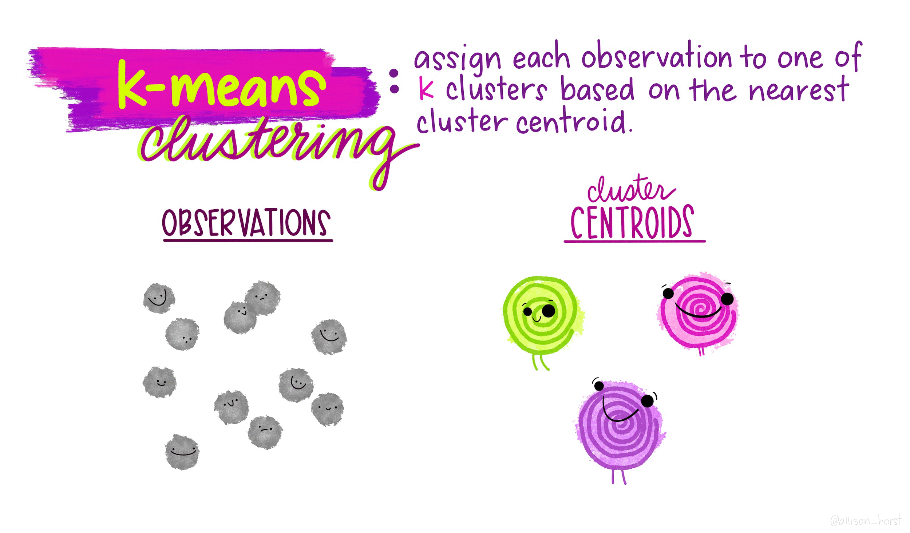
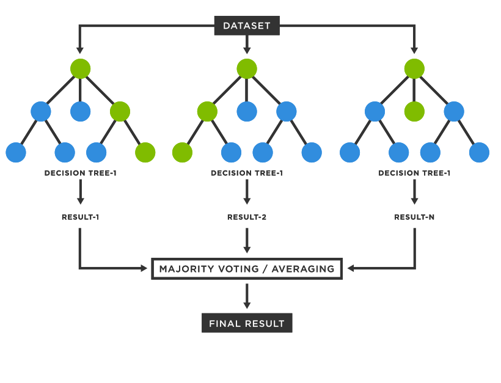

------------------------------------------------------------------------

## Workshop's agenda

-   **Day 1**: Introduction to QGIS
-   **Day 2**: Automatic update of census EA and national sampling frame
-   **Day 3**: Introduction to R programming
-   **Day 4**: Introduction to sampling design
-   **Day 5**: Advanced R programming
-   **Day 6**: Earth observation (EO) for sampling design
-   **Day 7: AI and machine learning for sample selection**
-   **Day 8**: Simulation and optimization of sampling strategies
-   **Day 9**: R Shiny for sampling design evaluation
-   **Day 10**: Wrap-up and workshop evaluation

------------------------------------------------------------------------

## Course materials

1.  Today's course materials are on **Github**: https://github.com/gianlucaboo/sampling_design_workshop
2.  Click on **Day 7: AI and machine learning for sample selection**
3.  **Copy the url** and **paste it** on https://download-directory.github.io
4.  Save the zipped directory on the workshop and unzip it

------------------------------------------------------------------------

## Today's agenda

-   Introduction to AI and ML in sampling\
-   K-means clustering for stratification\
-   Random forest for sample weighting and prediction\
-   Implementation in R with tidymodels\
-   Practical exercises\

------------------------------------------------------------------------

## AI and ML in sampling

-   Improve **sampling efficiency and representativeness**
-   Detect patterns in **complex population data**
-   **Reduce bias** and **improve stratification**
-   **Reduce sample** size while maintaining accuracy

).](img/sampling_workflow.gif){fig-align="left"}

------------------------------------------------------------------------

## Overview of ML

There are many ML algorithms, where the most common are:

-   **Supervised learning:** prediction based on known outcomes
-   **Unsupervised learning:** finding patterns/clusters without labeled outcomes

).](img/ml.png){fig-align="left"}

------------------------------------------------------------------------

## ML workflow

ML has a training, validation, and prediction workflow:

{fig-align="left"}

------------------------------------------------------------------------

## K-means clustering

::::: columns
::: {.column width="50%"}
-   This is an **unsupervised learning** method
-   Detect **natural groups** in population data
-   Useful for creating **representative samples**
:::

::: {.column width="50%"}
-   k-means: widely used for **stratification**
-   Partition population into **K clusters**
-   Minimize **within-cluster variance**
:::
:::::

{fig-align="left"}

------------------------------------------------------------------------

## K-means in R

**The Iris dataset**

-   British statistician and biologist **Ronald Fisher** in his 1936 paper.\
-   The data set consists of **50 samples** from each of **three species** of Iris.\
-   Four features were measured: the **length and the width of the sepals and petals**, in centimeters.

::::: columns
::: {.column width="33%"}
{fig-align="center" width="225"}
:::

::: {.column width="33%"}
{fig-align="center"}
:::
:::::

::: {.column width="33%"}
{fig-align="center"}
:::

:::::

------------------------------------------------------------------------

## K-means in R

**A first glimpse at the data set**

```{r}
#| echo: true
#| eval: false

library(tidyverse)

# Explore dataset
iris |> 
  head(n=2)

# Plot species
ggplot(iris, aes(x=Sepal.Length, y=Sepal.Width, color=factor(Species))) +
  geom_point(size=3) +
  theme_minimal() +
  labs(color="Cluster")
```

ℹ️ Try to run the code in your Script Editor.

------------------------------------------------------------------------

## K-means in R

**K-means clustering with `k=3`**

```{r}
#| echo: true
#| eval: false

library(tidymodels); library(tidyverse); library(cluster)

## Remove species
data <- 
  iris |> 
  select(-Species)
  
## K-means clustering
kmeans_fit <- 
  kmeans(scale(data), centers = 3) # it is important to scale and center the data

data <- 
 data |> 
  mutate(Cluster=kmeans_fit$cluster,
         Species=iris |> pull(Species))

ggplot(data, aes(x=Sepal.Length, y=Sepal.Width, color=factor(Cluster))) +
  geom_point(size=3) +
  theme_minimal() +
  labs(color="Cluster")
```

ℹ️ Try to run the code in your Script Editor. Try to use 4 or 5 clusters.

------------------------------------------------------------------------

## K-means in R

The output of `kmeans_fit` is a list of vectors:

-   `cluster` contains information about each point\
-   `centers`, `withinss`, and `size` (3 values) contain information about each cluster\
-   `totss`, `tot.withinss`, `betweenss`, and `iter` (1 value) contain information about the full clustering

```{r}
#| echo: true
#| eval: false

library(purrr); library(tidymodels); library(tidyverse); library(cluster)

k_means_multiple_fit <- 
  c(1:9) |> 
  map (function(k) {
      kmeans(scale(data |> select(-c(Cluster, Species))), centers = k) |>
      _$cluster |> 
      data.frame()
}) |> 
  list_cbind() |> 
  cbind(iris) |>
  pivot_longer(cols=starts_with("kmeans"), names_to="k", values_to="Cluster") |> 
  mutate(k=k |>  str_sub(-1, -1))

ggplot(k_means_multiple_fit, aes(x=Sepal.Length, y=Sepal.Width, color=factor(Cluster))) +
  geom_point(size=2) +
  theme_minimal() +
  facet_wrap(vars(k))+
  labs(color="Cluster")
```

ℹ️ Try to run the code in your Script Editor.

------------------------------------------------------------------------

## K-means in R

Additionally the total within sum of squares in the `tot.withinss` column represents the variance within the clusters. It generally decreases as `k` increases, and a bend (or “elbow”) indicates that additional clusters beyond the third have little value.

```{r}
#| echo: true
#| eval: false

library(purrr); library(tidymodels); library(tidyverse); library(cluster)

k_means_multiple_withinss <- 
  c(1:9) |> 
  map (function(k) {
      kmeans(scale(data), centers = k) |>
      _$tot.withinss |> 
      data.frame()
}) |> 
 list_cbind() |> 
  pivot_longer(cols=everything(), names_to="k", values_to="tot.withinss") |> 
  mutate(k=k |>  str_sub(-1, -1) |> as.numeric())

ggplot(k_means_multiple_withinss, aes(x=k, y=tot.withinss)) +
  geom_line()+
  geom_point(size=3) +
  theme_minimal()
```

ℹ️ Try to run the code in your Script Editor.

------------------------------------------------------------------------

## Random forest

::::: columns
::: {.column width="50%"}
**Decision trees**\
- A decision tree splits data into branches based on feature values (e.g., “Is age \> 30?”).\
- Trees are easy to interpret but can overfit (memorize the training data).\

**Bootstrap sampling (“bagging”)**\
- The algorithm randomly selects samples (with replacement) from the training data to build each tree.\
- This creates slightly different datasets for each tree.\
:::

::: {.column width="50%"}
**Random feature selection**\
- At each split in a tree, it considers only a random subset of features (not all of them).\
- This makes the trees more diverse and reduces correlation among them.\

**Voting or averaging**\
- For **classification**, each tree votes for a class; the majority wins.\
- For **regression**, the forest prediction is the average of all tree outputs.\
:::
:::::

{fig-align="left"}

------------------------------------------------------------------------

## Random forest in R

```{r}
#| echo: true
#| eval: false

library(tidymodels)

# Split data
set.seed(123)
data_split <- initial_split(iris |> select(-Species), prop = 0.8)
train <- training(data_split)
test <- testing(data_split)

# Define recipe and model
rf_recipe <- recipe(Petal.Length ~ ., data = train)

rf_model <- rand_forest(trees = 500) |> 
  set_engine("ranger", importance = "permutation") |> 
  set_mode("regression")
```

ℹ️ Try to run the code in your Script Editor.

------------------------------------------------------------------------

## Training the random forest

```{r}
#| echo: true
#| eval: false

# Workflow
rf_wf <- 
  workflow() |> 
  add_recipe(rf_recipe) |> 
  add_model(rf_model)

# Fit model
rf_fit <- 
  rf_wf |>
  fit(data = train)

# Predict
rf_preds <- 
  predict(rf_fit, test) |> 
  bind_cols(test)
```

ℹ️ Try to run the code in your Script Editor.

------------------------------------------------------------------------

## Evaluating performance

```{r}
#| echo: true
#| eval: false

rf_preds |> 
  metrics(truth = Petal.Length, estimate = .pred)
```

Typical outputs:\
- **RMSE**: root mean squared error (lower is better)\
- **R²**: proportion of variance explained (higher is better)

------------------------------------------------------------------------

## Visualizing predictions

```{r}
#| echo: true
#| eval: false

  ggplot(data=rf_preds, aes(x = Petal.Length, y = .pred)) +
  geom_point(size=3, color="black") +
  geom_abline(slope=1, intercept=0, linetype="dashed") +
  theme_minimal() +
  labs(x="Observed Petal.Length", y="Predicted Petal.Length")
```

ℹ️ Try to run the code in your Script Editor.

------------------------------------------------------------------------

## Variable importance

```{r}
#| echo: true
#| eval: false

library(vip)

rf_fit |> 
  extract_fit_parsnip() %>% 
  vip::vip(num_features = 3)
```

ℹ️ Try to run the code in your Script Editor.

------------------------------------------------------------------------

## Using RF predictions for Sampling

-   Predict probability of selection or outcome
-   Compute weights: $w_i = 1 / p_i$
-   Adjust sample to improve representativeness

------------------------------------------------------------------------

## K-means and Random Forest

**Use** - K-means: identify clusters for stratified sampling - Random Forest: weight or prioritize units within clusters

\*\*Practical Considerations

-   Choosing **K** in k-means (elbow method)
-   Number of trees in random forest
-   Handle missing data appropriately
-   Scale/normalize features before clustering

------------------------------------------------------------------------

## Introduction to tidymodels

-   **tidymodels** is a collection of R packages for modeling and machine learning.\
-   Built on the **tidyverse** philosophy: consistent, tidy syntax.\
-   Provides tools for the entire modeling workflow:
    -   **rsample** → data splitting, resampling\
    -   **recipes** → preprocessing and feature engineering\
    -   **parsnip** → model specification\
    -   **tune** → hyperparameter tuning\
    -   **yardstick** → model evaluation

```{r}
#| echo: true
#| eval: false
# Install tidymodels (if not already)
# install.packages("tidymodels")

library(tidymodels)
```

------------------------------------------------------------------------

## Models supported in tidymodels (via parsnip)

::::: columns
::: {.column width="50%"}
-   **Linear models**
    -   `linear_reg()` → linear regression
    -   `logistic_reg()` → logistic regression
-   **Tree-based models**
    -   `decision_tree()` → classification/regression trees
    -   `rand_forest()` → random forests
    -   `boost_tree()` → gradient boosting
-   **Support vector machines**
    -   `svm_linear()`, `svm_poly()`, `svm_rbf()` → SVM variants
-   **Nearest neighbors**
    -   `nearest_neighbor()` → k-nearest neighbors (KNN)
-   **Generalized additive models**
    -   `gen_additive_mod()` → flexible smooth models
-   **Neural networks**
    -   `mlp()` → multi-layer perceptron models
:::

::: {.column width="50%"}

```{r} 
#| echo: false 
#| eval: true 
#| fig-width: 8 
#| fig-height: 6

library(DiagrammeR)

grViz(" digraph tidymodels { graph [rankdir = LR, fontsize = 10]

node [shape = box, style = filled, color = grey90, fontname = Helvetica]

subgraph cluster_reg { label = 'Regression / GLM' color = grey70 linear [label = 'Linear Regressionn(linear_reg)'] logistic [label = 'Logistic Regressionn(logistic_reg)'] }

subgraph cluster_tree { label = 'Tree-based' color = grey70 dt [label = 'Decision Treen(decision_tree)'] rf [label = 'Random Forestn(rand_forest)'] gb [label = 'Boosted Treesn(boost_tree)'] }

subgraph cluster_svm { label = 'Support Vector Machines' color = grey70 svm_lin [label = 'Linear SVMn(svm_linear)'] svm_poly [label = 'Polynomial SVMn(svm_poly)'] svm_rbf [label = 'RBF SVMn(svm_rbf)'] }

subgraph cluster_nn { label = 'Other' color = grey70 knn [label = 'K-Nearest Neighborsn(nearest_neighbor)'] gam [label = 'GAMn(gen_additive_mod)'] nn [label = 'Neural Networkn(mlp)'] } } ")
```
:::
:::::

👉 Many more available through **extensions** (e.g., `xgboost`, `keras`, `glmnet`).

------------------------------------------------------------------------

## tidymodels workflow

```{r}
#| echo: false
#| eval: false

library(tidymodels)

set.seed(123)
data_split <- initial_split(iris, prop = 0.8)
train <- training(data_split)
test  <- testing(data_split)

# Recipe: preprocessing
rec <- recipe(Sepal.Length ~ ., data = train)

# Model specification: linear regression
lm_spec <- linear_reg() |> set_engine("lm")

# Workflow
wf <- workflow() |> add_recipe(rec) |> add_model(lm_spec)

# Fit model
fit <- fit(wf, data = train)

fit
```

##Resampling with rsample

```{r}
#| echo: true
#| eval: false

# Create 5-fold cross-validation splits
set.seed(123)
cv_folds <- vfold_cv(iris, v = 5)

cv_folds
```

##Hyperparameter tuning with tune

```{r}
#| echo: true
#| eval: false

# Define random forest model with hyperparameters to tune
rf_tune <- rand_forest(mtry = tune(), trees = 500, min_n = tune()) |> 
  set_engine("ranger") |> 
  set_mode("regression")

# Define grid of candidate values
rf_grid <- grid_regular(mtry(range = c(1,4)), min_n(), levels = 3)

# Run grid search with cross-validation
rf_tuned <- tune_grid(
  workflow() |> add_recipe(rf_recipe) |> add_model(rf_tune),
  resamples = cv_folds,
  grid = rf_grid
)
```

## ML-Based Sampling

**Advantages**

-   Data-driven stratification\
-   Capture complex patterns in population\
-   Reduce variance and sampling bias\

**Limitations**

-   Requires sufficient population data\
-   Black-box predictions may reduce interpretability\
-   Computationally intensive for large datasets\

------------------------------------------------------------------------

## Take home

-   AI/ML complements traditional sampling
-   K-means identifies clusters for stratification
-   Random Forest helps prioritize or weight units
-   R/tidymodels provides reproducible workflow
-   Visualization is key for interpretation

------------------------------------------------------------------------

## Resources

-   James, G., Witten, D., Hastie, T., Tibshirani, R. (2021). *An Introduction to Statistical Learning with Applications in R*. Springer. <https://www.statlearning.com>
-   Kuhn, M., & Wickham, H. (2023). *tidymodels: Unified Interface for Modeling in R*. <https://www.tidymodels.org>
-   Pebesma, E. (2018). *Simple Features for R*. R Journal. <https://journal.r-project.org>
-   R Core Team. (2025). *R: A Language and Environment for Statistical Computing*. <https://www.R-project.org>
-   Grolemund, G., Wickham, H. (2017). *R for Data Science*. <https://r4ds.had.co.nz>
