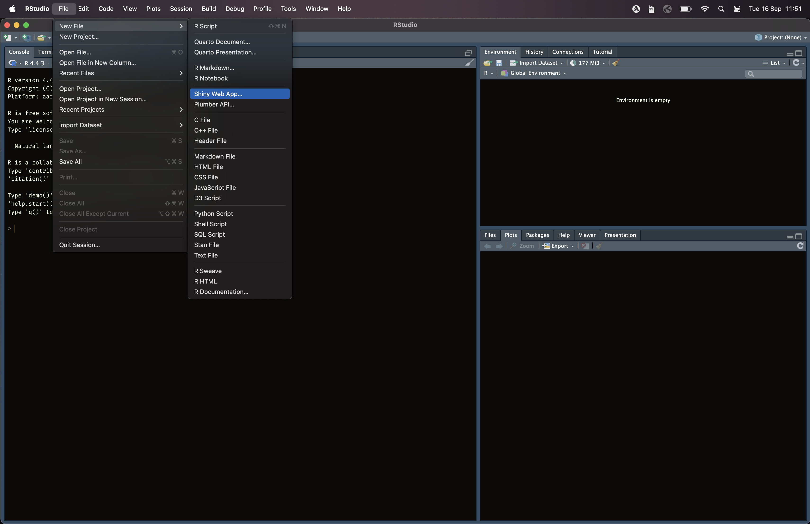
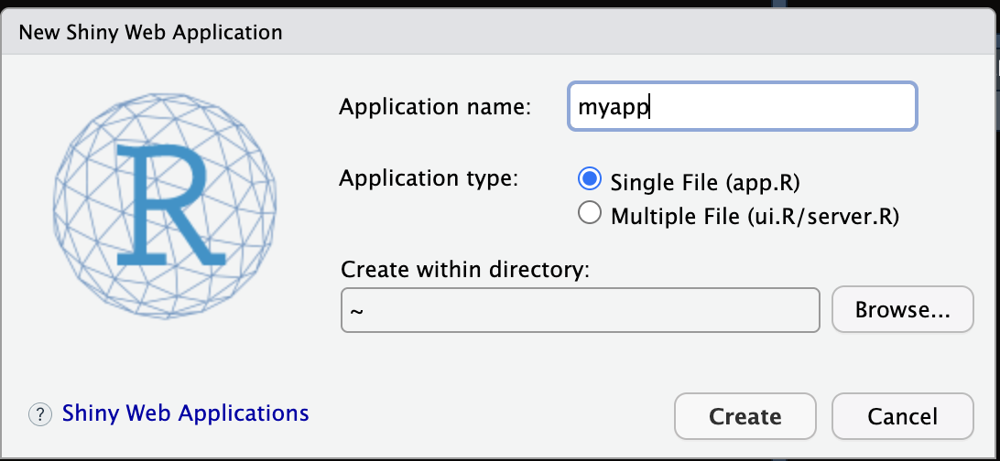

------------------------------------------------------------------------

## Workshop's agenda

-   **Day 1**: Introduction to QGIS
-   **Day 2**: Automatic update of census EA and national sampling frame
-   **Day 3**: Introduction to R programming
-   **Day 4**: Introduction to sampling design
-   **Day 5**: Advanced R programming
-   **Day 6**: Earth observation (EO) for sampling design
-   **Day 7**: AI and machine learning for sample selection
-   **Day 8**: Simulation and optimization of sampling strategies
-   **Day 9: R Shiny for sampling design evaluation**
-   **Day 10**: Wrap-up and workshop evaluation

------------------------------------------------------------------------

## Course materials

1.  Today's course materials are on **Github**: https://github.com/gianlucaboo/sampling_design_workshop
2.  Click on **Day 9: R Shiny for sampling design evaluation**
3.  **Copy the url** and **paste it** on https://download-directory.github.io
4.  Save the zipped directory on the workshop and unzip it

------------------------------------------------------------------------

## Today's agenda

-   Introduction to R Shiny 
-   Layouts and themes\
-   Inputs (sliders, selectors, text, etc.)\
-   Outputs (tables, plots, maps)\
-   Deployment options
-   Applications to sampling design

------------------------------------------------------------------------

## R Shiny

-   Shiny is an R package for building **interactive web applications** directly from R.\
-   Originally developed for R by RStudio (now Posit), it is now available in Python.\
-   Allows embedding of code, reactive UI elements (sliders, inputs, etc.), and outputs (plots, tables, etc.) that update when inputs change.

::: embed
<iframe src="https://phillyo.shinyapps.io/intelligentsia/" width="100%" height="350">

</iframe>
:::

------------------------------------------------------------------------

## Shiny app structure

::::: columns
::: {.column width="50%"}
You can create a Shiny web app directly in R.

Every Shiny app has two main parts:

1.  **UI (User Interface)**: defines layout and inputs/outputs visible to the user.
2.  **Server**: defines how inputs are processed, computations, reactive expressions, outputs created.
:::

::: {.column width="50%"}



:::
:::::

------------------------------------------------------------------------

## Shiny app example

This is a structure of your shiny app.

```{r}
#| echo: true
#| eval: false

library(shiny)

ui <- fluidPage(
  titlePanel("Hello Shiny"),
  sidebarLayout(
    sidebarPanel(
      sliderInput("bins", "Number of bins:", min = 1, max = 50, value = 30)
    ),
    mainPanel(
      plotOutput("hist")
    )
  )
)

server <- function(input, output, session) {
  output$hist <- renderPlot({
    x <- faithful$waiting
    hist(x, breaks = input$bins,
         col = "skyblue", border = "white",
         main = "Histogram of Old Faithful waiting times",
         xlab = "Waiting time")
  })
}

shinyApp(ui = ui, server = server)
```

ℹ️ Try to run the app using the **Run app** button.

------------------------------------------------------------------------

## The user interface (UI)

R Shiny's UI mostly leverage `html`, `bootstap`, and `css` but these are wrapped into `R` functions can be implemented seamlessly with **no previous knowledge of other languages**.

**UI Definition**\
- Built with `fluidPage()`, `navbarPage()`, `dashboardPage()`, etc.\
- Determines the overall layout of the app\

**Layout Options**\
- **Fluid grid system** (rows & columns)\
- **Sidebar vs. main panel**\
- **Tabbed navigation** and multipage apps\

**Input Widgets**\
- Text, numeric, slider, date, file upload, checkboxes, radio buttons\
- Provide interactivity for users\

**Output Elements**\
- Display tables, plots, maps, text\
- Automatically update with user input\

**Styling & Themes**\
- Built-in **Bootstrap** framework\
- Use `{bslib}` for modern theming (e.g., Bootswatch themes, custom css)\
- Responsive design for desktop and mobile\

------------------------------------------------------------------------

## UI layouts

::: embed
<iframe src="https://shiny.posit.co/r/layouts/" width="100%" height="750">

</iframe>
:::

------------------------------------------------------------------------

## UI inputs


------------------------------------------------------------------------

## The server

**Core Role**\
- Contains the **logic of the application with R code**   - Links **inputs, reactive expressions, and outputs**\

**Reactive Programming**\
- `reactive()` stores reactive values\
- `observe()` and `observeEvent()` run code in response to changes\
- `render*()` functions (e.g., `renderPlot`, `renderTable`) create dynamic outputs\

**Input / Output Binding**\
- Inputs accessed with `input$` (e.g., `input$slider1`)\
- Outputs assigned with `output$` (e.g., `output$plot1`)\

**Automatic Updates**\
- When an input changes, dependent expressions and outputs recalculate\
- Ensures smooth interactivity without manual refreshing\

**Server Function**

```{r}
#| echo: true
#| eval: false
  server <- function(input, output, session) {
    output$plot1 <- renderPlot({
      hist(rnorm(input$n))
    })
  }
```

------------------------------------------------------------------------

## Connecting UI and server

-   **Input** functions/widgets, for example, `sliderInput()`, `selectInput()`, `textInput()`.
-   **Reactive** expressions/functions are computed when their inputs change, and those dependencies tracked automatically, for instance when the slider input value changes.
-   **Render** functions, for example, `renderPlot()`, `renderText()`, `renderTable()`.
-   **Output** functions/widgets, for example, `plotOutput()`, `tableOutput()`.


------------------------------------------------------------------------

## Leaflet Maps

Use the **`leaflet`** package to add interactive maps:

``` r
library(shiny)
library(leaflet)

ui <- fluidPage(
  leafletOutput("mymap")
)

server <- function(input, output, session) {
  output$mymap <- renderLeaflet({
    leaflet() %>%
      addTiles() %>%
      addMarkers(lng = -122.4194, lat = 37.7749, popup = "San Francisco")
  })
}

shinyApp(ui, server)
```

ℹ️ Try to create a new app.

------------------------------------------------------------------------

## Interactive plots

Combine **`ggplot2`** and **`plotly`** to create interactive plots:

``` r
library(shiny)
library(ggplot2)
library(plotly)

ui <- fluidPage(
  plotlyOutput("plot")
)

server <- function(input, output, session) {
  output$plot <- renderPlotly({
    p <- ggplot(mpg, aes(displ, hwy, color = class)) + geom_point()
    ggplotly(p)
  })
}

shinyApp(ui, server)
```

ℹ️ Try to create a new app.

------------------------------------------------------------------------

## Interactive tables

Use **`DT`** (DataTables) for interactive tables

``` r
library(shiny)
library(DT)

ui <- fluidPage(
  DTOutput("table")
)

server <- function(input, output, session) {
  output$table <- renderDT({
    datatable(iris, options = list(pageLength = 5))
  })
}

shinyApp(ui, server)
```

ℹ️ Try to create a new app.

------------------------------------------------------------------------

## Shiny Apps deployment

Once you build a Shiny app, you can run it locally with `runApp()` or launch it via RStudio. For sharing it you can use the following solutions:\
- **shinyapps.io** (hosted service with free plan)\
- Own **Shiny Server**\
- Posit Connect / other hosting platforms (hosted service)

::: embed
<iframe src="https://www.shinyapps.io" width="100%" height="350">

</iframe>
:::

------------------------------------------------------------------------

## Shiny sampling design

**Interactive simulation**\
- Explore different sample sizes, strata, or cluster settings - Visualize sampling distributions in real time

**Parameter uning**\
- Adjust inputs (e.g., population size, confidence level, design effect) - Observe how estimates (mean, variance, SE) change dynamically

**Visualization tools**\
- Display histograms, confidence intervals, and coverage probabilities - Interactive plots for comparing designs

**Scenario comparison**\
- Compare simple random, stratified, or cluster sampling - Evaluate efficiency and precision across methods

**Practical benefits**\
- Supports teaching and training in survey methods - Facilitates decision-making for field survey design - Deployable via [shinyapps.io](https://www.shinyapps.io) for easy access

------------------------------------------------------------------------

## Take home

-   **R Shiny** enables creation of interactive applications directly from R.\
-   Every app has two key components: **UI** (what users see) and **Server** (logic & reactivity).\
-   Shiny apps can include **dynamic inputs** (sliders, selectors, text) and **reactive outputs** (plots, tables, maps).\
-   **Deployment options** include shinyapps.io, Shiny Server, and Posit Connect.\
-   For **sampling design evaluation**, Shiny provides:
    -   Real-time simulation and visualization\
    -   Easy comparison of sampling strategies\
    -   A powerful tool for both teaching and decision-making.

------------------------------------------------------------------------

## Resources

Chang, W., Cheng, J., Allaire, J. J., Xie, Y., & McPherson, J. (2025).  
  *shiny: Web Application Framework for R*. R package version 1.9.0.  
  <https://shiny.posit.co>

- Sievert, C. (2020). *Interactive Web-Based Data Visualization with R, plotly, and shiny*. Chapman & Hall/CRC.  
  <https://plotly-r.com>

- Posit. (2025). *Shiny Documentation*.  
  <https://shiny.posit.co/r/getstarted/shiny-basics/>

- Cheng, J., Karambelkar, B., & Xie, Y. (2023). *leaflet: Create Interactive Web Maps with the JavaScript 'Leaflet' Library*. R package version 2.2.2.  
  <https://rstudio.github.io/leaflet/>

- Xie, Y., Cheng, J., & Tan, X. (2023). *DT: A Wrapper of the JavaScript Library 'DataTables'*. R package version 0.30.  
  <https://rstudio.github.io/DT/>

------------------------------------------------------------------------

## Exercise

Please download the R directory with a sample app from [GitHub](https://github.com/gianlucaboo/sampling_design_workshop/blob/main/code/07_rhiny/07_rhiny_exercise.R) and try to understand the logic behind it.

